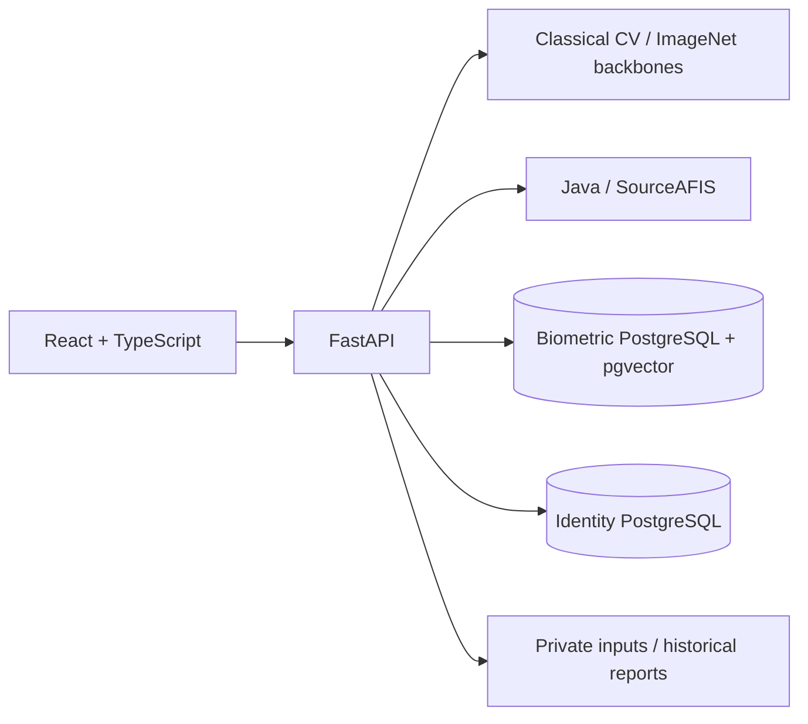

# Fingerprint Verification & Identification Workbench

A local application for comparing two images, enrolling a small gallery,
searching with vector retrieval and pairwise reranking, and exploring archived
research reports.

The workbench combines **React/TypeScript, FastAPI, PostgreSQL/pgvector,
Python computer vision and a Java SourceAFIS service**. It is a software and
research prototype, not a certified identity or security product.

## What you can do

- Compare uploaded images with six classical CV routes and two pretrained
  image-embedding routes. Synthetic examples work without a research dataset.
- Run SourceAFIS verification with explicit image DPI and an unnormalized score.
- Enroll fictitious identities, retrieve a PostgreSQL shortlist and rerank
  candidates with the selected pairwise matcher.
- Keep identity metadata separate from biometric metadata and vectors.
- Browse curated examples, dataset previews and historical benchmark artifacts.
- Import a saved scanner file or use the optional Windows TWAIN capture helper.

The [engineering case study](docs/ENGINEERING_CASE_STUDY.md) explains the
implementation, integration problems and validation approach.

## Related research projects

This repository is the application and systems-engineering workbench in a broader
research effort. Continuing Level-3 work is centered in
[fingerprint-l3-benchmark](https://github.com/Mish2000/fingerprint-l3-benchmark).
The [completed 500 PPI benchmark](https://github.com/Mish2000/fingerprint-benchmark)
preserves the matcher comparison, while the
[ML/CV case study](https://github.com/Mish2000/fingerprint-new-method) covers
synthetic pore localization and its transfer limits. The
[research project map](https://github.com/Mish2000/fingerprint-l3-benchmark/blob/main/docs/research-projects.md)
explains the four roles. Archived reports shown by this application retain their
original experimental identities.

## Architecture



The browser reaches FastAPI through the development proxy. Python performs
preprocessing, feature extraction, vector retrieval and reranking. SourceAFIS
runs behind a local HTTP boundary. Docker runs the databases; the host runs
API, UI and Java. This hybrid arrangement is intentional.

A **method** is a local CV/model route; an external **provider** is an engine
such as SourceAFIS. Neither silently substitutes for the other. SourceAFIS
provider-native identification is tested through its Python interface and does
not supply the PostgreSQL shortlist vectors.

## Quick start on Windows

Prerequisites: an existing Miniconda installation, Docker Desktop running with
Linux containers, and Node.js **24.18.0**. The scripts do not change global PATH
or Conda base. The supported profile uses Python 3.11 and Java 17.

From the checkout root in PowerShell:

```powershell
# One-time isolated CPU installation; preserves existing environments.
.\scripts\dev\bootstrap.ps1

# Generate private passwords and explicit database URLs.
.\scripts\dev\workbench.ps1 init-config

# Explicit resource preparation.
.\scripts\dev\workbench.ps1 build-java
.\scripts\dev\workbench.ps1 prepare-models

# Read-only prerequisites, then the complete hybrid stack.
.\scripts\dev\workbench.ps1 check
.\scripts\dev\workbench.ps1 start
```

Open [the local workbench](http://127.0.0.1:5173/?tab=verify). Choose **Manual
Upload → Use synthetic verification pair**, select a method and run verification.
**Use synthetic SourceAFIS pair** supplies a 500-DPI software test input.
These fixtures contain no human fingerprints and provide no accuracy evidence.

Stop owned services while preserving database volumes:

```powershell
.\scripts\dev\workbench.ps1 stop
```

If the named environment already exists, choose a fresh `-EnvironmentName` when
bootstrapping and select that name in the workbench wrapper. The
[runbook](docs/LOCAL_DUAL_DB_RUNBOOK.md) covers existing installations, test
databases, CPU/CUDA selection, scanner setup and recovery.

## Capabilities

This is the single operational capability table. Research reports retain their
own historical result tables and provenance.

| Capability | Status and scope |
|---|---|
| Classical verification | Six active routes exercised with real implementations and synthetic inputs |
| ResNet18 and ViT-B/16 | Official ImageNet weights; real CPU and RTX 5080 inference, finite 512D/768D outputs |
| SourceAFIS 1:1 | Real browser → Python → Java comparison; explicit DPI, raw score, no implicit decision threshold |
| SourceAFIS provider 1:N | Real extraction/verification/identification integration; separate from pgvector retrieval |
| PostgreSQL identification | Two databases and real enrollment/retrieval/rerank/deletion; local inputs support upload reranking |
| Catalog and report browsing | Six catalogs, 2,894 exposed asset URLs checked; archived reports preserved |
| Scanner | x86 helper rebuilt; driver discovery and physical TWAIN capture tested locally; explicit file bridge |
| Dedicated patch method | Retired from active API/UI; original checkpoint unavailable; legacy evidence metadata retained |
| Full historical reproduction | Blocked by missing original manifests/splits; retained pair CSVs do not recover all original inputs |

Active methods: `classic_orb`, `classic_gftt_orb`, `minutiae`, `harris`, `sift`,
`sift_plain_roll_v2`, `dl`, `vit`. Compatibility aliases include `classic`,
`classic_v2` and `dl_quick`. `sift_plain_roll_v2` remains rerank-only for
identification; no global retrieval vector was invented for it.

## Runtime and validation

- CPU is the default even on a CUDA-capable machine. The optional CUDA 12.8
  profile uses PyTorch 2.7.1 and torchvision 0.22.1 with Blackwell support.
  CPU/GPU numerical identity is not claimed.
- Downloads occur only in `prepare-models`. Runtime loading checks local file
  identity and uses a strict state dictionary; imports and liveness do not download.
- `/live` describes process liveness. `/ready` checks initialized methods,
  both database connections and SourceAFIS. Lazy startup is not fully ready.
- The launcher records process ownership, waits for readiness and stops owned
  process trees. Compose pins the database image by digest.
- Software tests use synthetic inputs. Real database/Java integration is distinct
  from unit tests with substitutes and from optional historical artifact checks.
- CI covers backend software, two PostgreSQL/pgvector roles, Java/SourceAFIS and
  the UI on Linux. Windows installation locks are not used to install Linux.

See [CONTRIBUTING](CONTRIBUTING.md) for checks and publication rules, and the
[runbook](docs/LOCAL_DUAL_DB_RUNBOOK.md#validation) for integration commands.

## Historical research evidence

Existing reports retain their original source and protocol bindings. They are
not results of this runtime or its software fixtures. No research benchmark was
rerun to prepare this presentation.

- [Classical baseline summary](artifacts/reports/benchmark/plain_roll_final_baselines_v1/plain_roll_final_summary.md)
- [SourceAFIS summary](artifacts/reports/benchmark/plain_roll_final_sourceafis_v1/plain_roll_final_summary.md)
- [Dataset registry](configs/datasets.yaml) and [method definitions](configs/methods.yaml)

Eight selected-pair CSVs remain in the two final bundles. Four SourceAFIS files
match their recorded manifest hashes; all eight match the preservation inventory.
Across six families, 87 configuration-declared manifest/protocol paths are absent.
This includes optional/raw-only entries; the existence of every original bundle
is not established. No new selection, split, training, threshold calibration or
replacement checkpoint filled that gap.

## Attribution and limits

[SourceAFIS](https://sourceafis.machinezoo.com/) supplies an external fingerprint
matcher. ResNet/ViT use official
[torchvision weights](https://docs.pytorch.org/vision/stable/models.html) trained
on ImageNet. They are not fingerprint models trained here or anatomical pore
detectors. Existing source notices retain upstream authorship and terms.

Raw scores are not probabilities. A configured threshold is a demonstration
policy, not a population FAR guarantee. Different routes and image resolutions
have different semantics; upsampling does not create native fine detail.

Raw datasets, private paths, weights, captures, templates and embeddings stay
local. New public fixtures are synthetic. Existing research assets and reports
retain their original terms; no blanket third-party license is granted.
