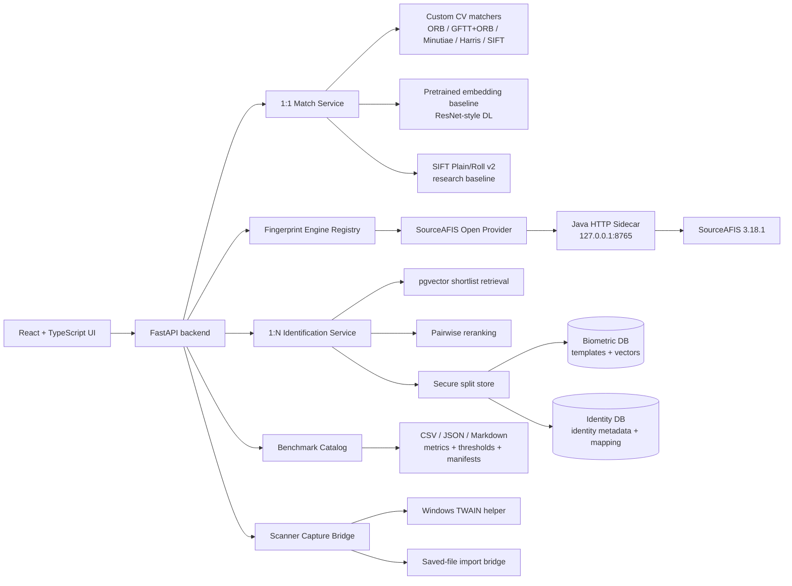

# Fingerprint Research Platform

> Research-grade fingerprint verification and identification platform with audited plain-vs-roll benchmarks, an optional SourceAFIS sidecar, a FastAPI backend, a React/TypeScript UI, and reproducible evidence artifacts.

<p align="center">
  
</p>

<p align="center">
  
  
  
  
  
  
</p>

This repository is an end-to-end biometric research system, not a single notebook. It includes 1:1 fingerprint verification, 1:N identification, benchmark artifact exploration, method registry discipline, optional scanner integration, and an open-AFIS comparison path through SourceAFIS.

The latest evidence focuses on the difficult **NIST SD300B / SD300C plain-vs-roll protocol**: one plain impression matched against one rolled impression, with positive pairs sharing subject and finger position and negative pairs using different subjects while preserving the same plain-vs-roll structure.

## Current headline result

The strongest current evidence is the optional `sourceafis_open` provider, implemented through a local Java SourceAFIS sidecar and evaluated through the same audited selected-pair protocol as the custom baselines.

**Locked TEST operating points, thresholds calibrated on VAL negatives only:**

| Dataset | Method | Target FAR | TEST TAR | TEST FAR | TEST FRR | TA / FR / FA / TR | AUC | EER | Avg ms/pair |
|---|---|---:|---:|---:|---:|---:|---:|---:|---:|
| NIST SD300B | SourceAFIS Open | 1.00% | 77.14% | 0.71% | 22.86% | 540 / 160 / 5 / 695 | 0.8902 | 17.00% | 163.1 |
| NIST SD300C | SourceAFIS Open | 1.00% | 77.57% | 1.14% | 22.43% | 543 / 157 / 8 / 692 | 0.8815 | 17.50% | 338.4 |
| NIST SD300B | SourceAFIS Open | 0.50% | 76.00% | 0.43% | 24.00% | 532 / 168 / 3 / 697 | 0.8902 | 17.00% | 163.1 |
| NIST SD300C | SourceAFIS Open | 0.50% | 74.00% | 0.43% | 26.00% | 518 / 182 / 3 / 697 | 0.8815 | 17.50% | 338.4 |

Protocol notes:

- Each dataset/split uses **1,400 selected pairs**: 700 positive and 700 negative pairs.
- The SourceAFIS final bundle covers SD300B VAL, SD300B TEST, SD300C VAL, and SD300C TEST: **5,600 audited pairs** in total.
- Pair audits pass with **0 invalid positives, 0 invalid negatives, 0 missing files, 0 duplicates, 0 modality mismatches, and 0 finger mismatches**.
- Thresholds are selected from **VAL negative scores only** and then applied unchanged to TEST.
- SourceAFIS scores are raw similarity scores; the project calibrates them per dataset/protocol before reporting accept/reject operating points.

Primary evidence paths:

```text
artifacts/reports/benchmark/plain_roll_final_sourceafis_v1/plain_roll_final_summary.md
artifacts/reports/benchmark/plain_roll_final_sourceafis_v1/plain_roll_final_manifest.json
artifacts/reports/benchmark/plain_roll_final_sourceafis_v1/plain_roll_final_metrics.csv
artifacts/reports/benchmark/plain_roll_final_sourceafis_v1/plain_roll_final_thresholds.csv
artifacts/reports/benchmark/plain_roll_final_sourceafis_v1/plain_roll_final_latency_summary.csv
artifacts/reports/benchmark/plain_roll_final_sourceafis_v1/plain_roll_final_tar_far_distribution.csv
artifacts/reports/benchmark/plain_roll_final_sourceafis_v1/final_markdown/nist_sd300b_sourceafis_open_plain_roll_final.md
artifacts/reports/benchmark/plain_roll_final_sourceafis_v1/final_markdown/nist_sd300c_sourceafis_open_plain_roll_final.md
```

## Custom baseline comparison

The best custom/research baseline in the current final bundle is `sift_plain_roll_v2`. It remains valuable because it shows the custom computer-vision research path, but the SourceAFIS sidecar is substantially stronger on the same selected-pair protocol.

| Dataset | Method | Target FAR | TEST TAR | TEST FAR | AUC | EER | Avg ms/pair | Role |
|---|---|---:|---:|---:|---:|---:|---:|---|
| NIST SD300B | SourceAFIS Open | 1.00% | 77.14% | 0.71% | 0.8902 | 17.00% | 163.1 | Open-AFIS production candidate |
| NIST SD300B | SIFT Plain/Roll v2 | 1.00% | 50.00% | 1.57% | 0.7882 | 29.57% | 121.4 | Strongest custom baseline |
| NIST SD300C | SourceAFIS Open | 1.00% | 77.57% | 1.14% | 0.8815 | 17.50% | 338.4 | Open-AFIS production candidate |
| NIST SD300C | SIFT Plain/Roll v2 | 1.00% | 43.14% | 0.43% | 0.7859 | 28.79% | 155.3 | Strongest custom baseline |

Baseline evidence paths:

```text
artifacts/reports/benchmark/plain_roll_final_baselines_v1/plain_roll_final_summary.md
artifacts/reports/benchmark/plain_roll_final_baselines_v1/plain_roll_final_manifest.json
artifacts/reports/benchmark/plain_roll_final_baselines_v1/plain_roll_final_metrics.csv
artifacts/reports/benchmark/plain_roll_final_baselines_v1/final_markdown/
```

## What this project demonstrates

- **1:1 verification** with curated demo cases, dataset browsing, manual upload, score/threshold reporting, latency breakdowns, and visual match overlays.
- **1:N identification** with enrollment, search, deletion, demo galleries, browser-mode galleries, vector shortlisting, and pairwise reranking.
- **Provider-neutral fingerprint engine abstraction** for template extraction, 1:1 verification, 1:N identification, quality hooks, and provider metadata.
- **Open AFIS integration** through a local SourceAFIS Java HTTP sidecar, without importing the Java matcher directly into the Python API.
- **Audited benchmark protocol** with selected pair CSVs, strict pair audits, VAL calibration, locked TEST reporting, threshold tables, TAR/FAR distributions, latency summaries, manifests, and final markdown evidence.
- **Method registry discipline**: API names, aliases, benchmark names, UI labels, method families, threshold references, retrieval support, rerank support, vector dimensions, and presentation tiers are centralized in `configs/methods.yaml`.
- **Privacy-aware storage design**: biometric templates/vectors and identity metadata can be split across separate PostgreSQL databases, with inspection/reconciliation endpoints and redacted connection diagnostics.
- **Scanner integration path** for a Biometrika HiScan-Pro workflow through a Windows TWAIN helper and saved-file bridge fallback.

## UI preview

| Live demo | Verification | Identification |
|---|---|---|
|  |  |  |

The UI is designed as a stakeholder-facing research interface: Live Demo landing flow, verification workspace, identification workspace, benchmark evidence explorer, local preferences, theme/language support, and clear operational states.

## System architecture



## Core workflows

### Verification, 1:1

The verification workspace compares two fingerprint images and returns a decision-oriented response: score, threshold, method metadata, latency, optional overlay evidence, and user-facing narrative. It supports curated demo cases, catalog-backed dataset browsing, and manual upload.

### Identification, 1:N

The identification workflow separates fast shortlist retrieval from final pairwise reranking. Retrieval-capable methods generate deterministic vectors for candidate shortlist search, while rerank-capable methods perform authoritative pairwise scoring against shortlisted candidates.

Available modes:

- **Demo Mode**: curated, server-backed gallery and probe stories.
- **Browser Mode**: isolated catalog-backed gallery selection for repeatable 1:N experiments.
- **Operational Mode**: lower-level enrollment, search, deletion, and diagnostics.

### Benchmark Explorer

The benchmark workspace presents validated evidence instead of only raw metric tables. It surfaces final curated evidence from:

```text
artifacts/reports/benchmark/plain_roll_final_sourceafis_v1/
artifacts/reports/benchmark/plain_roll_final_baselines_v1/
```

The catalog code also keeps compatibility with older full/smoke H5 benchmark bundles when present, but the current README headline is intentionally based on the final plain-vs-roll evidence bundles above.

### Live Demo

The Live Demo is a guided stakeholder flow: enrollment capture, separate probe capture, and an Identify 1:N result hero. It intentionally separates enrollment and probe sources to avoid same-image demo shortcuts.

### Scanner capture

The scanner layer supports two capture providers:

- **Direct TWAIN capture** through the Biometrika helper executable path.
- **Saved-file bridge** for importing the latest externally produced scan.

The backend exposes scanner status, capture, latest-import, and normalized asset endpoints. The UI supports direct capture, scanner-UI capture, import-latest, manual upload, status reporting, and a countdown before headless capture.

## Recognition methods

| Method | Runtime role | Benchmark role | Status |
|---|---|---|---|
| Classic ORB | 1:1 verification, 1:N retrieval, rerank | API/runtime classic baseline | Active canonical runtime method |
| Classic ROI GFTT+ORB | 1:1 verification, 1:N retrieval, rerank | `classic_v2` benchmark family | Canonical baseline |
| Classic Minutiae | 1:1 verification, 1:N retrieval, rerank | `minutiae` | Canonical custom baseline |
| Harris + ORB | 1:1 verification, 1:N retrieval, rerank | `harris` | Canonical custom baseline |
| SIFT | 1:1 verification, 1:N retrieval, rerank | `sift` | Canonical custom baseline |
| SIFT Plain/Roll v2 | Pairwise verification/rerank | `sift_plain_roll_v2` | Strongest custom plain-vs-roll baseline |
| Pretrained DL embedding | 1:1 verification, vector retrieval, rerank | `dl_quick` / `dl` | Canonical baseline |
| Dedicated Patch AI | Pairwise research rerank | `dedicated` | Experimental / research |
| SourceAFIS Open Matcher | Template extraction, 1:1 verification, 1:N identification | `sourceafis_open` | Optional external open-AFIS provider |
| COTS AFIS Primary | Future provider adapter | `cots_afis_primary` | Stub / future integration point |

The custom methods and the SourceAFIS provider are deliberately separated. The custom methods demonstrate algorithmic implementation and research experimentation. SourceAFIS provides an open AFIS reference point with native biometric templates and raw similarity scores that require protocol-specific calibration.

## SourceAFIS sidecar

`sourceafis_open` is exposed through a local Java HTTP sidecar in `apps/sourceafis-service`. The Python backend does not directly import SourceAFIS, and the API still starts when the sidecar is absent. In that case, SourceAFIS remains registered but reports `available=false` through metadata.

The sidecar is documented in:

```text
docs/sourceafis_sidecar_contract.md
src/fpbench/fingerprint_engine/providers/sourceafis_client.py
src/fpbench/fingerprint_engine/providers/sourceafis_provider.py
apps/sourceafis-service/
```

Build and validate:

```powershell
cd apps/sourceafis-service
mvn test
mvn package
cd ../..

.\scripts\dev\check_sourceafis_sidecar.ps1
```

Run locally:

```powershell
.\scripts\dev\run_sourceafis_sidecar.ps1

$env:SOURCEAFIS_ENABLED = "true"
$env:SOURCEAFIS_SERVICE_URL = "http://127.0.0.1:8765"
```

Health check:

```powershell
curl.exe http://127.0.0.1:8765/health
```

Expected provider metadata includes SourceAFIS `3.18.1`, `template_format=sourceafis`, verification support, identification support, and no quality support.

## Identification evidence

The repository also includes final 1:N identification evidence. This is not a verification FAR/FRR benchmark; it proves repeatability and deterministic vector storage behavior.

### Self-match repeatability, 1,000-image gallery

```text
artifacts/reports/identification/self_match_repeatability_1000_top1_final.md
```

- Dataset: `nist_sd300b`
- 1,000 selected images
- 1,000 enrolled records
- 1,000 self-query cases per method
- Methods: `classic_gftt_orb`, `minutiae`, `harris`, `sift`, `dl`
- Shortlist size: 25
- Rerank policy: `top1`
- Enrollment errors: 0
- Query errors: 0
- Retrieval Top-1 self-match: 100% for every method
- Final Top-1 self-match: 100% for every method

### Vector reproducibility

```text
artifacts/reports/identification/vector_reproducibility_final.md
```

The same fingerprint image is vectorized twice with each retrieval method. All compared 512-dimensional vectors are exactly equal, allclose equal, have maximum absolute difference 0, and produce identical SHA-256 hashes per method. This supports reproducible pgvector storage and method-generic retrieval-vector architecture.

## Tech stack

| Layer | Technologies |
|---|---|
| Backend | Python 3.11, FastAPI, Pydantic, Uvicorn |
| Computer vision | OpenCV, NumPy, ORB, GFTT, Harris, SIFT, skeletonized crossing-number minutiae, geometric verification |
| Deep learning | PyTorch, torchvision pretrained backbones |
| Open AFIS | SourceAFIS 3.18.1 through a Java/Maven HTTP sidecar |
| Storage | PostgreSQL, pgvector, optional split biometric/identity databases |
| Frontend | React 19, TypeScript, Vite, Tailwind CSS, lucide-react |
| Testing | pytest, FastAPI TestClient, Vitest, TypeScript contract tests |
| Scanner path | Windows TWAIN helper, saved-file bridge fallback |

## Repository layout

```text
apps/
  api/                         FastAPI application, schemas, services, scanner bridge, benchmark catalog
  sourceafis-service/           Java SourceAFIS HTTP sidecar
  ui/                          React + TypeScript stakeholder interface
configs/
  datasets.yaml                Dataset registry and manifest expectations
  methods.yaml                 Central method registry and capability contract
  thresholds.yaml              Decision thresholds and benchmark defaults
docs/
  benchmark_methods.md         Benchmark/method documentation
  scanner_capture.md           Scanner capture setup and troubleshooting
  sourceafis_sidecar_contract.md
  research/                    Advisor-facing evidence summaries
pipelines/
  benchmark/                   Evaluation runners, validation, final benchmark bundles
scripts/
  dev/                         Local SourceAFIS sidecar helpers and diagnostics
src/fpbench/
  fingerprint_engine/          Provider-neutral engine abstraction and SourceAFIS provider
  identification/              Secure split store and identification primitives
  matchers/                    Classic, deep, and experimental matchers
  ui_assets/                   Dataset/catalog UI asset pipeline
tests/                         Backend, sourceafis, benchmark, scanner, identification tests
artifacts/reports/
  benchmark/                   Curated benchmark evidence bundles
  identification/              Final identification evidence summaries
```

Large raw datasets, transient generated outputs, caches, checkpoints, scanner captures, and legacy archive folders are intentionally excluded from normal Git tracking. In the cleaned local layout, raw datasets can live outside the repository root, typically under `C:\fingerprint-datasets\raw`, and can be exposed back to the project through a local `data\raw` junction.

## Running locally

### 1. Create the Python environment

```bash
conda env create -f environment.yml
conda activate fingerprint_research
```

### 2. Start PostgreSQL + pgvector

```bash
docker compose -f apps/api/docker-compose.yml up -d biometric_db identity_db
```

PowerShell runtime variables:

```powershell
$env:BIOMETRIC_POSTGRES_PASSWORD = "change_me_biometric_dev_password"
$env:IDENTITY_POSTGRES_PASSWORD = "change_me_identity_dev_password"
$env:DATABASE_URL = "postgresql://admin:$env:BIOMETRIC_POSTGRES_PASSWORD@127.0.0.1:5432/biometric_db"
$env:IDENTITY_DATABASE_URL = "postgresql://admin:$env:IDENTITY_POSTGRES_PASSWORD@127.0.0.1:5433/identity_db"
```

If `IDENTITY_DATABASE_URL` is omitted, the store can fall back to a single-database deployment.

### 3. Optional: start SourceAFIS

```powershell
.\scripts\dev\run_sourceafis_sidecar.ps1
$env:SOURCEAFIS_ENABLED = "true"
$env:SOURCEAFIS_SERVICE_URL = "http://127.0.0.1:8765"
```

### 4. Run the API

```bash
uvicorn apps.api.main:app --reload
```

Useful endpoints:

```text
GET    /api/health
GET    /api/fingerprint-engine/metadata
GET    /api/methods
POST   /api/match
GET    /api/benchmark/runs
GET    /api/benchmark/summary
GET    /api/benchmark/comparison
GET    /api/benchmark/best
GET    /api/catalog/datasets
GET    /api/catalog/dataset-browser
GET    /api/identify/stats
POST   /api/identify/enroll
POST   /api/identify/search
GET    /api/scanner/status
POST   /api/scanner/capture
```

### 5. Run the UI

```bash
cd apps/ui
npm install
npm run dev
```

Production build:

```bash
npm run build
```

## Reproducing benchmark evidence

### Custom baseline final bundle

```powershell
python pipelines/benchmark/run_plain_roll_final_benchmark.py `
  --datasets nist_sd300b,nist_sd300c `
  --methods sift_plain_roll_v2,sift,harris,classic_v2,minutiae `
  --splits val,test `
  --outdir artifacts/reports/benchmark/plain_roll_final_baselines_v1 `
  --limit_per_split 0 `
  --sample_strategy balanced_spread `
  --sample_seed 13 `
  --strict_pair_audit
```

### SourceAFIS final bundle

Start the sidecar first, set `SOURCEAFIS_ENABLED=true`, then run:

```powershell
python pipelines/benchmark/run_sourceafis_plain_roll_final_benchmark.py `
  --datasets nist_sd300b,nist_sd300c `
  --splits val,test `
  --outdir artifacts/reports/benchmark/plain_roll_final_sourceafis_v1 `
  --sourceafis_outdir artifacts/reports/benchmark/plain_roll_final_sourceafis_v1/run_meta/sourceafis_raw `
  --target_far 0.01 0.005
```

The SourceAFIS final runner reads canonical pairs from `data/manifests/nist_sd300b` and `data/manifests/nist_sd300c`, materializes run-local `selected_pairs` as output, and reuses complete raw SourceAFIS outputs only when their pair SHA256 metadata matches the current run. For NIST DPI-sensitive runs, keep the project's DPI validation path intact: SD300B is 1000 PPI/DPI and SD300C is 2000 PPI/DPI.

## Testing

Backend tests used by this evidence pack include:

```bash
python -m pytest \
  tests/test_benchmark_api.py \
  tests/test_plain_roll_final_benchmark.py \
  tests/test_professor_1000_pos_neg_benchmark.py \
  tests/test_sourceafis_client_contract.py \
  tests/test_sourceafis_plain_roll_benchmark_metrics.py \
  tests/test_sourceafis_plain_roll_thresholds.py \
  tests/test_sourceafis_provider_metadata.py \
  tests/test_scanner_capture_api.py \
  tests/test_vector_reproducibility_demo.py \
  -q
```

Frontend tests and production build:

```bash
cd apps/ui
npm test
npm run build
```

The tests cover final benchmark evidence surfacing, pair audit failures, VAL-threshold application to TEST, SourceAFIS client/provider contracts, DPI handling, selected-pair reuse, benchmark catalog path traversal guards, scanner capture behavior, vector reproducibility, and UI workspace behavior.

## Data and artifact expectations

The repository is designed to work with local datasets and generated artifacts without committing large or sensitive raw data to Git.

Typical local paths:

```text
data/raw/                                      Local junction/dataset mount, usually external to Git
data/manifests/<dataset>/                     Manifest and pair protocol files
data/processed/<dataset>/ui_assets/           Curated UI previews/thumbnails for demo/catalog browser
data/scanner_captures/                        Local scanner runtime workspace, not tracked
artifacts/reports/benchmark/                  Curated benchmark summaries, scores, thresholds, manifests
artifacts/reports/identification/             Final identification evidence summaries
artifacts/cache/embeddings/                   Local embedding cache, not tracked
artifacts/checkpoints/                        Model checkpoints, not tracked
```

The dataset registry currently includes NIST SD300B, NIST SD300C, PolyU cross-modality, PolyU 3D, UNSW 2D/3D, and L3-SF V2. Dataset files must be obtained and prepared separately according to their original terms and the project ingest pipeline.

## Privacy and security posture

This is a research prototype, but several implementation choices are intentionally production-aware:

- Biometric data and identity metadata can be separated into different PostgreSQL databases.
- Admin inspection endpoints redact sensitive database URLs.
- Identification diagnostics expose schema/readiness state without requiring UI-side secrets.
- SourceAFIS sidecar requests are local HTTP calls and the sidecar is designed to avoid persistence of images/templates.
- Scanner captures are runtime artifacts and should be governed by an explicit retention policy.
- Benchmark and catalog asset routes include path traversal protection.
- Raw datasets, scanner captures, caches, and checkpoints are excluded from normal Git tracking.

## Current limitations

- This is a research and demonstration system, not a certified biometric product.
- Benchmark results are transparent research metrics and must not be interpreted as production FAR/FRR guarantees without calibration on the target deployment population.
- SourceAFIS raw scores are not normalized by the provider; thresholds must be calibrated per dataset/protocol.
- The current final plain-vs-roll TEST splits use 700 negative pairs each, so 1% FAR corresponds to roughly 7 false accepts and 0.5% FAR to roughly 3-4 false accepts. Lower FAR claims would require substantially larger negative sets.
- Large datasets, model checkpoints, scanner captures, and generated caches are intentionally local and may not be available after a fresh clone.
- Direct TWAIN capture is Windows-specific and depends on a registered TWAIN stack and expected scanner source.
- Dedicated Patch AI remains experimental until stronger reproducible benchmark evidence justifies promotion.

## Author & research supervision

**Michael Sirakovich**<br>
Computer Science graduate. Project development, system architecture, implementation, benchmarking, UI/API integration, and research artifact preparation.

**Academic advisor:** Prof. Menachem Domb<br>
Research guidance and academic supervision.
